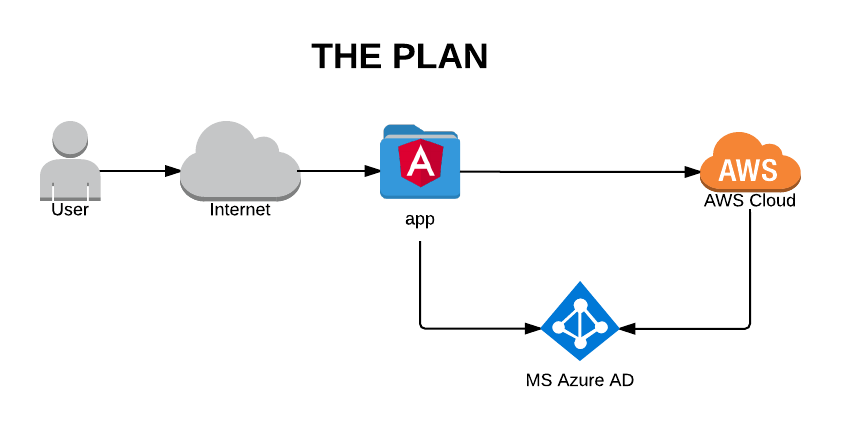
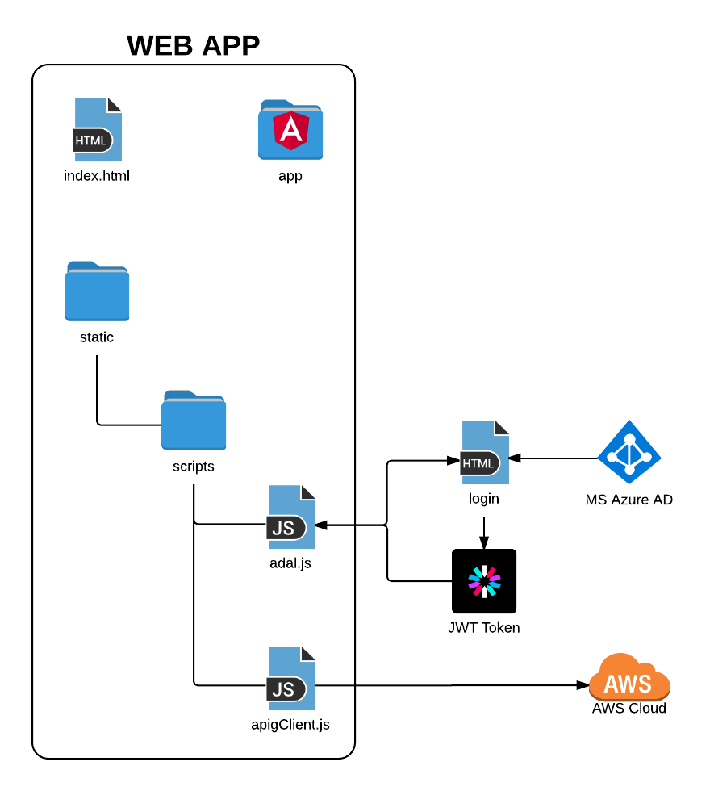
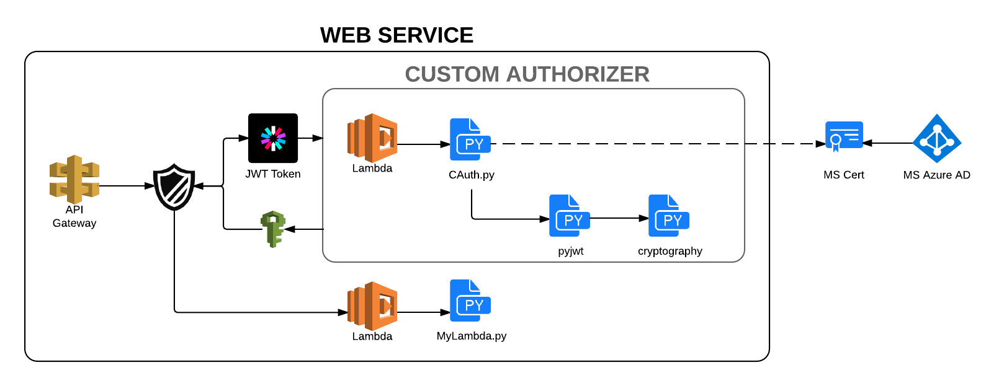

# TLDR;

Do you need/want to secure your #AWS #Serverless #REST API #WebService, and matching #AngularJS (1.x) #SPA Web App through #MSAzureAD? Easy:

* Use [ADAL.js](https://github.com/AzureAD/azure-activedirectory-library-for-js) in your web app for authentication, and obtain an id token ([#OpenID Connect](https://docs.microsoft.com/en-us/azure/active-directory/develop/active-directory-protocols-openid-connect-code) prototcol)
* Include the id token in the requests from your web app to your web service as Authorization Bearer
* Use a Custom Authorizer in your web service to validate the tokens, against the public certificates published by MS

The 3 conceptual steps above actually turn into a few more practical steps, sorry. If you're in a hurry:

* *Skip ahead* to [BAS4](../BAS4-pws/README.md) to:
   * Build CertsGrabber (script to grab the certificates published by MS)
   * Build CustAuth (the Custom Authorizer)
   * Deploy the Web Service CloudFormation Stack
   * Grab the auto-generated AWS JS SDK
* Backtrack to [BAS3](../BAS3-pwa/README.md) to:
   * Add the AWS JS SDK obtained in the previous step to the *\src\js\apiGateway-js-sdk* directory
   * Build the Web App locally
   * Deploy the Web App CloudFormation Stack

**KTHXBYE**

# Building a Shield

> "This should be tied to our corporate identity provider."

That's how it starts. And, admittedly, it's not a bad idea. Tying your application to the corporate authentication service means:

* your users will have one less set of credentials to remember
* you won't have to build an authentication/authorization service
* your organization has one less worry, as the identity management of their employees is centralized

So, let's say that:

* "our corporate identity provider" is a MS Active Directory running on MS Azure
* "this" (the app to be protected via the corporate identity provider) is a serverless solution running on AWS

## The Plan

At a high level, here's what we're going to build:

In simple terms, we have a User accessing a Web App through their web browser. The App interacts with a Web Service to perform the necessary operations (eg: read and write data). However, we wish to protect this set up so that only authenticated and authorized users (according to a corporate identity provider) can gain access to the Web App and the Web Service functionality.

The Web App is going to be an [AngularJS](https://angularjs.org/) Single-Page App (SPA). 
The Web Service will be a serverless service hosted on [AWS](https://aws.amazon.com/). 
The Corporate Identity Provider will be a [MS Azure Active Directory](https://docs.microsoft.com/en-us/azure/active-directory/active-directory-whatis) instance. 

As you can see in the diagram, both the Web App and the Web Service will interact with the Corporate Identity Provider. The former to allow the user to log in, and the latter to verify the user's credentials.

## The Web App

Zooming in on the Web App:

Aside from the standard *index.html* and */app* which constitute the basic AngularJS SPA, we have a couple of scripts that deal with the communications to the cloud services:

* **adal.js:** A Microsoft-authored library to interact with MS Azure ActiveDirectory (eg: redirect the user to the log in screen when needed, and obtain their credentials in the form of a [JWT Token](https://jwt.io/) ).
* **apigClient.js:** an AWS-authored library implementing a Javascript client to facilitate communications with the Web Service.

## The Web Service

Zooming in on the Web Service:

A simple unprotected web service would simply include the AWS *API Gateway* service, the *AWS Lambda* service, and the *MyLambda.py* function. We have a few more components:

* **the shield:** the shield icon to the right of the *API Gateway* service simply represents the configuration of API Gateway with a *Custom Authorizer*. This means that when a request is received by API Gateway, it will trigger the configured authorizer. if the results returned by the authorizer indicate access is granted, API gateway will continue as usual, by triggering the configured Lambda function. Otherwise, an error is returned.
* **JWT Token** and **IAM Policy**: the token is received as part of the HTTP Request received by API Gateway, and passed to the Custom Authorizer for validation. The IAM Policy is the means by which the authorizer communicates the results. In our example, we'll simply return a Policy that will either *Allow* or *Deny* access to all resources, but in general, since you have to return a Policy, you could get more granular, if needed.
* **CAuth.py:** The Custom Authorizer is implemented as a (python) Lambda function. It uses the public certificate retrieved from MS Azure (and other configuration values) to validate the given JWT Token. A corresponding IAM Policy is constructed and returned. Note that the Custom Authorizer leverages the 3rd-party **pyjwt** and **cryptography** libraries to perform the validation.

## The Details

The sections above list and briefly describe each of the elements necessary for this solution. They do not mention the additional, ancillary components necessary for such a system to actually be usable (eg: hosting solutions for the web app and web service, scripts to automate development and deployment processes, etc..). The rest of this write up, over multiple 'chapters', goes into greater details about each of those steps.

The hope is that writing it all up (and automating the processes whenever possible), will save you time from *exploring/hacking* on your own, as the various parts involved where not necessarily designed with each other in mind.

# BAS Series
* [BAS - Intro](../BAS-intro/README.md)
* [BAS1 - Unprotected Web Service](../BAS1-uws/README.md)
* [BAS2 - Unprotected Web App](../BAS2-uwa/README.md)
* [BAS3 - Protecting the Web App](../BAS3-pwa/README.md)
* [BAS4 - Protecting the Web Service](../BAS4-pws/README.md)
