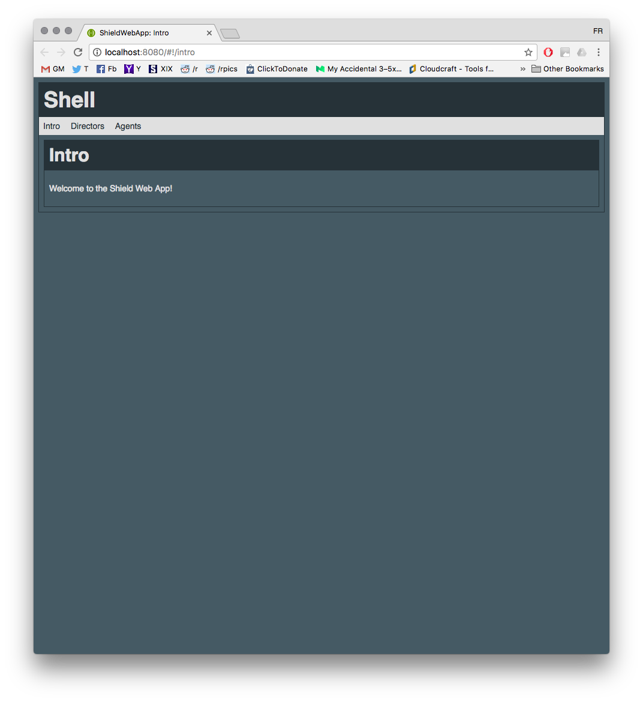
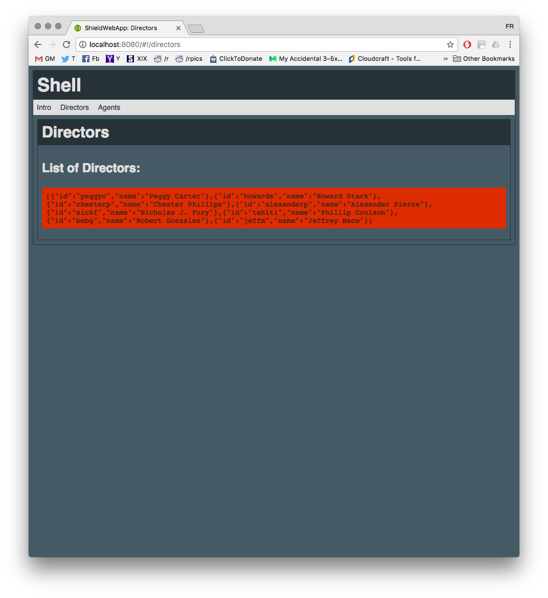
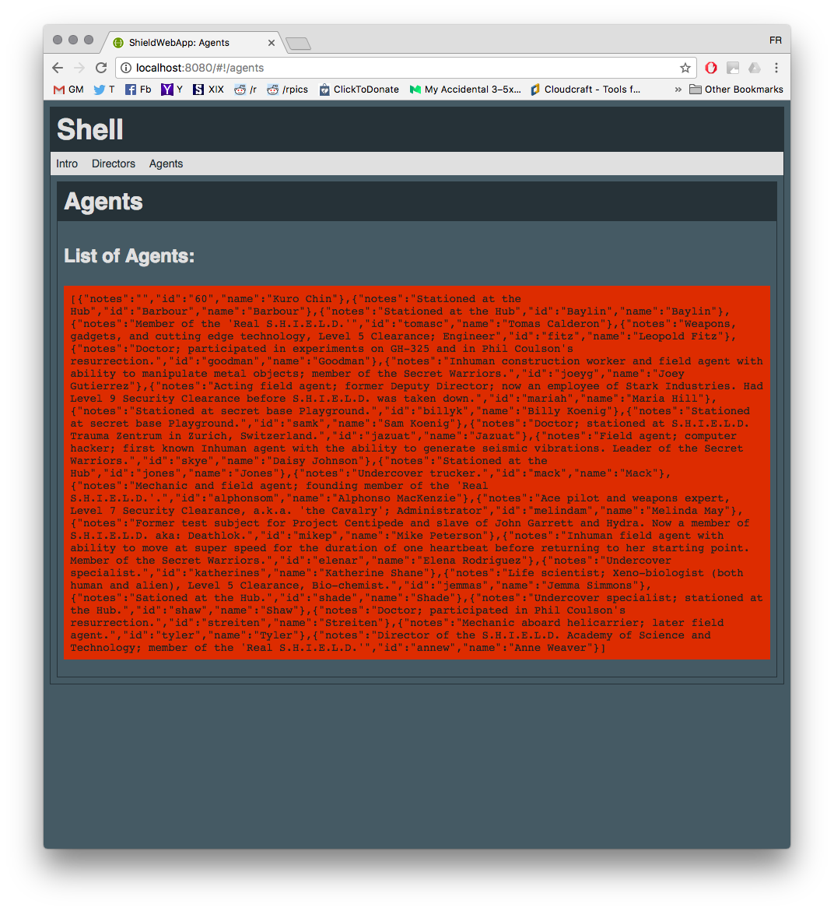

[Previously in the BAS Series](../BAS1-uws/README.md), we built an unprotected web service.

# Building a Shield: The Unprotected Web App

Time to build a companion web app for our unprotected web service.

## The Use Case

We have a web service returning two top-secret lists of sensitive information. Let's make an [AngularJS 1.x](https://angularjs.org/) Single-Page App (SPA) that can request data from the service and display it to the user. We'll build a shell for the SPA, with at least two "pages"/states:

* .../intro: a "landing page"
* .../directors: displaying the list of directors provided by the web service
* .../agents: displaying the list of agents provided by the web service

### Angular Styleguide

A note regarding the scope of this write-up: by and large, I am placing all questions related to best practices in building AngularJS SPAs **out of scope** of this article. Instead, I'll simply point you in the direction of [John Papa's Angular 1 Style Guide](https://github.com/johnpapa/angular-styleguide/blob/master/a1/README.md), which in my opinion is still the best reference in regard.

## Developing Locally

Let's set up a local development environment for our SPA.

### Project Structure

Before installing or running any tool, the local directory structure should be as follows:

* *\package.json:* the npm dependencies
* *\bower.json:* the bower dependencies
* *\gulp.config.js:* the gulp configuration file
* *\gulpfile.js:* the gulp script file
* *\src:* the source code for our SPA
   * *\index.html:* the source for the SPA's index file
   * *\js:* source for the *\apiGateway-js-sdk* JS SDK
   * *\sass:* SASS styles source
   * *\app:* source for the SPA App

During the development process, the following directories will also be created:

* *\bower_components:* installed bower modules
* *\node_modules:* installed nodejs/npm modules
* *\dist:* distribution directory - essentially the results of the build process

### Pre-requisites

To build and run the Shield Web App (SWA) locally, you need the following pre-requisites:

* **OS:** (*It shouldn't matter, right?*)<br />
   For the records I'm working on a **Mac OS/X Sierra (10.12.3)**, and have not (yet?) had the chance to replicate all of this on a different OS.
* **NodeJS: v.6.9.4**
* **npm: v.3.10.10**
* **gulp-cli: v.1.2.2**<br />
   Note that gulp-cli is also listed as a dependency in *package.json* below. However, I recommend installing it globally first, to enable using [gulp](http://gulpjs.com/) on the command line as needed. Currently, the recommended way to install the latest version of gulp is to:
   * Uninstall gulp globally: `$> npm rm --global gulp`
   * Install gulp-cli globally: `$> npm install --global gulp-cli`
   * Install gulp in your project: `$> npm install gulp`<br />
      (The *npm install* command below should take care of this last step for you)
* **aws_js_sdk.zip:**<br />
   One of the byproducts of the deployment process of the Unprotected Shield Web Service from the [Previous BAS Writeup](../BAS1-uws/README.md) is a *aws_js_sdk.zip* archive which contains a Javascript client matching the deployed API. You should:
   * **Extract** the contents of the zip archive, which should be a single *\apiGateway-js-sdk* directory holding *apigClient.js*, *README.md*, and a *\lib* subdirectory
   * **Copy** the *\apiGateway-js-sdk* directory into *\src\js*

Next, to initialize the environment, you'll want to perform these steps (one-time only):

* `$> npm install`<br />
   Will install the dependencies listed in *package.json*, and raise the *"postinstall"* trigger, which, in turn, will run the *"bower install"* command (see below).
* `$> bower cache clean`<br />
   This command prevents the next step from skipping bower packages you may have available elsewhere on your system.
* `$> bower install`<br />
   (Optional) as the previous *npm install* should trigger this. This command installs the dependencies listed in *bower.json*.

### Building SWA Locally

The *gulpfile.js* script lets you easily build SWA from *\src* into *\dist*, and serve the web app through [BrowserSync](https://browsersync.io/) (including watching for file changes to trigger rebuild and refresh of the web browser), via a single command:

* `$> gulp serve`.

The chain of dependencies within the Gulp File means that when we request the *serve* task, the following tasks take place (in order):

* *clear:* clears the destination directory
* *copy:* copies all files from the source directory to the destination directory
* *compile-sass:* compile the SASS styles to CSS
* *inject-css:* inject the CSS styles into the SWA index file
* *move-apig:* move (within the destination directory) the */js/apiGateway-js-sdk* library to */static/scripts*
* *clear-apig:* clears the */js/apiGateway-js-sdk/* subdirectory within the destination directory
* *inject-js:* injects JS links in the SWA index file
* *inject-bower:* injects the bower dependencies in the SWA index file, including moving the necessary files from the *\bower_components* directory to the *\dist\static\scripts* and *\dist\static\styles* directories (and modifying the injected references accordingly)
* *annotate:* inject AngularJS Dependencies in the SWA source
* *build:* clears the */sass* directory within the destination directory
* *build-done:* helper task to trigger a browser refresh when the build task is completed
* *serve:* serve the built SWA in a browser, and watchfor changes in the *\src* directory, *\package.json* and *\bower.json*

At the end of this process, SWA will be built into *\dist* and a web browser should be open onto the "Intro" landing page:



You can navigate to the "Directors" page and you'll see the list of Directors:



And the list of Agents on the "Agents" page:



## Source Highlights

As far as the SPA Source code, here's some highlights in regard to **how** we get the data from the web service, gathered from a few different files, using the *\app\directors* module as a sample of a module representing a page/state in our SPA.

[/app/directors/directors.module.js](./src/app/directors/directors.module.js): make the module depend on the *SWSClient* service:

```javascript
angular.module('app.directors', [
      'app.services.swsclient'
   ]).config(DirectorsConfig);
```

[/app/directors/directors.js](./src/app/directors/directors.js): the module uses the *SWSClient.GetDirectors* method to retrieve the data from the web service; in this case we do this upon the module's initialization, but it could easily be in reaction to a user's click:

```javascript
//=========================================================
function Init($state) {
   console.log("DirectorsController::Init");
   return SWSClient.GetDirectors()
      .then(function(data) {
         vm.directors = data;
         return vm.directors;
      });
}

//=========================================================
function GetDirectors() {
   console.log("DirectorsController::GetDirectors");
   return SWSClient.GetDirectors()
      .then(function(data) {
         vm.directors = data;
         return vm.directors;
      });
}
```

[/app/services/swsclient.js](./src/app/services/swsclient.js): the SWSClient service (in angular parlance) wraps around the *\js\apiGateway-js-sdk* library, which implements a client to interact with the web service:

```javascript
/* @ngInject */
function SWSClient($q) {
//============================================================
   var service = {
      GetDirectors: GetDirectors,
      GetAgents: GetAgents
   };
   return service;
   //=========================================================

   //=========================================================
   function GetDirectors() {
      var deferred = $q.defer();

      var apigClient = apigClientFactory.newClient();
      var params = {};
      var body = "{}";
      var additionalParams = {};

      apigClient.directorsGet(params, body, additionalParams)
         .then(function(response) {
            console.log("SWSClient::GetDirectors: received response.");
            var data = response.data.directors;
            var serialized_data = JSON.stringify(data);
            deferred.resolve(serialized_data);
         })
         .catch(function(err) {
            HandleError(err, "GetDirectors");
            deferred.reject(err);
         });
      return deferred.promise;
   }

   // [...]
}
```

## Hosting on AWS (HTTP)

We can easily get our static site to be served by AWS [through S3](https://docs.aws.amazon.com/AmazonS3/latest/dev/HowDoIWebsiteConfiguration.html), although it will be served only through the **HTTP** protocol.

* **Create an S3 bucket:**<br />
   * **Name:** we'll assume the bucket name is **swa.site**
   * **Region:** we'll use **US East (N. Virginia)**
   * **Versioning, Logging, Tagging:** not necessary
   * **Permissions:**
      * *Owner:* R+W on the Objects, R+W on the Object Permissions
      * *Public Permissions:* Everyone should have R access on Objects
      * *See also "Configure the Bucket Policy" below*
* **Configure the bucket for hosting:**<br />
   Through the AWS Web console, select the bucket in the list of the S3 buckets available to you, and click on its **Properties**.
   * select/expand the **Static Website Hosting** panel
   * **Note the given "Endpoint" URI** (eg: http://swa.site.s3-website-us-east-1.amazonaws.com), as this will be the URL where the site will be hosted
   * check/enable the **use this bucket to host a website** option
   * set the **index document** option to *index.html*
   * *Note:* we're not setting up an Error Document at this point, but we could configure one or more HTML documents to be returned under certain error conditions.
* **Configure the Bucket Policy:**<br />
   Although we configured the bucket so that everyone could Read objects from it, AWS requires us to repeat this in the form of a bucket policy associated with the bucket, which we can easily do through the AWS Web console:
   * S3 > List of buckets > click on the swa.site bucket
   * click on the **Permissions** tab, and the **Bucket Policy** button
   * Enter the policy from [swa-site-bucket-policy.json](./swa-site-bucket-policy.json) in the editor and save
      * Make sure you **modify the bucket name** in the policy itself if your bucket is not named *swa.site*

```python

```

Now that the bucket is ready, you can upload the contents of the *\dist* directory to it, either through the AWS Web console, or by leveraging the *s3 cp* or *s3 sync* AWS CLI commands, eg:

* `$> aws s3 cp ./dist s3://swa.site --recursive`

SWA should now be available through the **"Endpoint URL"** noted above (see "Configure the bucket for hosting").

## Hosting on AWS (HTTPS)

While AWS S3 lets us quickly host a static site over HTTP, we must leverage AWS CloudFront to support HTTPS.
At this stage, we can use one of the *default* Certificates provided by AWS CloudFront, and we don't have to use a custom domain.

[swa_cfn.yaml](./swa_cfn.yaml) is the Cloud Formation Template for our Shield Web App. It defines:

* **Parameter: SWABucket:** the name of the S3 bucket where the web app is available.
* **Parameter: SWACloudFrontOAI:** the CloudFront Distribution Origin Access Identity to use.
* **SWACloudFrontDistribution:** the CloudFront Distribution for the web app, with a single Origin sub-resource, pointing to the S3 bucket with the web app.
* **Output: SWADomain:** the domain where the CloudFront distribution becomes available.

[make.sh](./make.sh)  is a shell script to take care of the operations necessary to use the CloudFormation template to deploy our web app to AWS:

* Uploading the web app to S3
* Create a CloudFront Origin ACcess Identifier
* Deploy the CloudFormation template to the Stack
* Retrieve the CloudFormation stack output

<div class="note warning">
   <h5>BEFORE running the next steps, you should:</h5>
   <p>Create a Bucket, Ensure make.sh is executable, Configure make.sh.</p>
</div>

* **Create a Bucket to hold the web app files:**<br />
   If you created a *swa.site* bucket above (see "Hosting on AWS (HTTP)"), you can use that one; otherwise see that section for the configuration details.
* **Ensure make.sh is executable:**<br />
* `$> chmod u+x make.sh`
* **Configure make.sh:**<br />
   Open the shell script and modify the configuration at the top as appropriate:
   * **PROFILE:** the name of the AWS profile (configured on your machine via AWS CLI)
   * **SWABUCKET:** the name of the S3 Bucket to hold the SWA files
   * **SWASRC:** (optional) path leading to the SWA source files
   * **STACKNAME:** (optional) this can be used to have separate AWS Cloud Formation Stacks

**Finally:**

```shell
$>./make.sh 

Make for SWA:
========================================
AWS Profile              : aws_profile
Local Source             : ./dist
Hosting Bucket Name      : swa.site
Stack Name               : SWAStack

========================================
Uploading Site to S3:
========================================
upload: dist/app/error/error.html to s3://swa.site/app/error/error.html
upload: dist/app/app.module.js to s3://swa.site/app/app.module.js
[...]
   OK

========================================
Enable AWS CLI CloudFront Preview:
========================================
   OK

========================================
Creating CloudFront OAI:
========================================
Generating Unique Statement ID...
   OK
   Statement Id: 7169BAF0-D8BB-47D2-8B68-575EE3017C2D
Creating OAI...
   OK
   OAI Id: E1Y4MDG6AGFA8C
========================================
Deploying CloudFormation ChangeSet:
========================================
swa_cfn:
Waiting for changeset to be created..
Waiting for stack create/update to complete
Successfully created/updated stack - SWAStack
   OK

========================================
Retrieving Stack Outputs:
========================================
   OK
   SWADomain: d3dpirlv9crnvo.cloudfront.net

========================================
All Done.

```

**NOTE:** the deployment step of this type of stack template takes a while. This is because the CloudFormation engine waits onm the completion of the creation of the CloudFront Distribution. So, you'll see the *"Waiting for stack create/update to complete"* message on screen for some time.

The retrieved SWADomain is the domain where the app is now available, so you can point your web browser to either

* https://*SWADomain*.cloudfront.net/
* http://*SWADomain*.cloudfront.net/

## Progress!

You can use your web browser to ensure the web app is behaving as intended, both over HTTP and HTTPS.

Next time we'll start securing the sensitive information.

# BAS Series
* [BAS - Intro](../BAS-intro/README.md)
* [BAS1 - Unprotected Web Service](../BAS1-uws/README.md)
* [BAS2 - Unprotected Web App](../BAS2-uwa/README.md)
* [BAS3 - Protecting the Web App](../BAS3-pwa/README.md)
* [BAS4 - Protecting the Web Service](../BAS4-pws/README.md)
