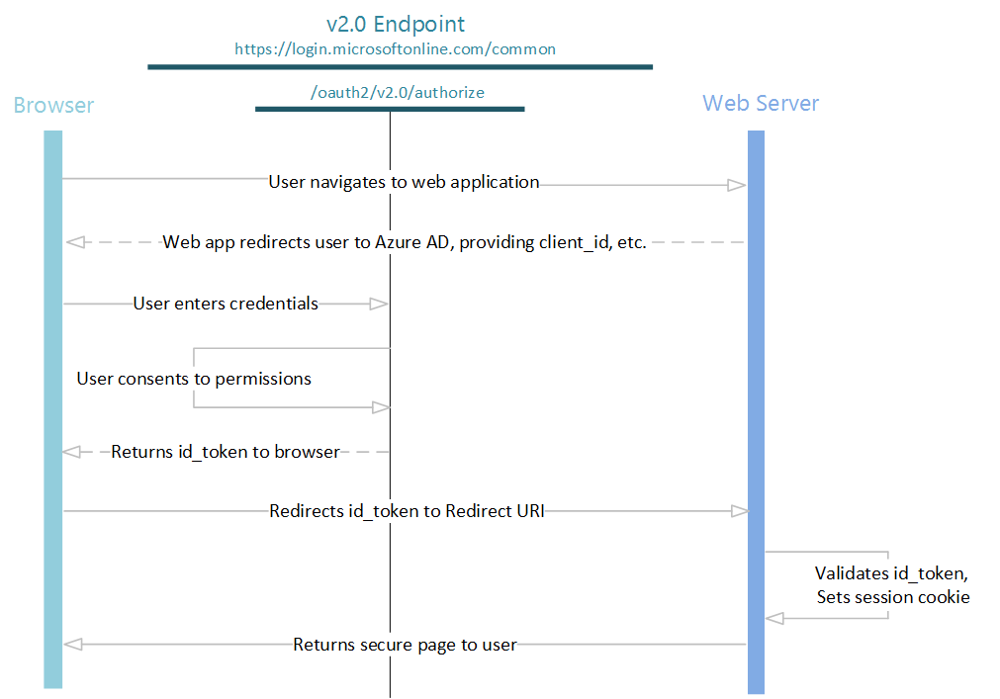

[Previously in the BAS Series](../BAS2-uwa/README.md), we built an unprotected web app.

# Building a Shield: Protecting the Web App

It's time to start building some fences around our highly sensitive data. We'll start by making our web app require the user to be signed on through our corporate identity provider, [MS Azure Active Directory](https://docs.microsoft.com/en-us/azure/active-directory/active-directory-whatis).

## The Use Case

The core features of our web app will not change, so we plan to have an app we can serve locally, or deploy for hosting on AWS, with the following pages/states:

* .../intro: a "landing page"
* .../directors: displaying the list of directors provided by the web service
* .../agents: displaying the list of agents provided by the web service

In addition, we want all of these pages to require the user to log in through our MS Azure AD before they can access the page.

## MS Azure AD

I will **not** dive too deply in the topic of MS Azure AD, as it is too vast, and by and large has no impact on the working of the web app and web service we're protecting. You can read more about this service [in the official MS Azure AD documentation](https://docs.microsoft.com/en-us/azure/active-directory/active-directory-whatis), of course. For our immediate needs, we simply need to establish some bits of data that the AD service, the web app, and web service can all refer to. Namely:

* **Tenant Id:** a unique identifier that represents your organization within the MS Azure service. See the [MS Azure AD docs](https://docs.microsoft.com/en-us/azure/active-directory/develop/active-directory-howto-tenant).
* **Client Id:** a unique identifier representing the specific application you wish to use MS Azure AD with. See the [MS Azure AD docs](https://docs.microsoft.com/en-us/azure/app-service-mobile/app-service-mobile-how-to-configure-active-directory-authentication)
* **Reply URL:** The URL that MS Azure AD should redirect a user to when they complete (sucesfully) the log in process. In the case of the SWA SPA web app we've been using, this would be root URL of the app, which, of course, depends on where the app will be hosted, eg: http://localhost:*port*/, or https://*www.YourDomain.example*/

Furthermore, although we don't have to specify this anywhere, the setup we're putting together will use the (*broken link, see next paragraph*) [OpenID Connect](https://docs.microsoft.com/en-us/azure/active-directory/active-directory-v2-protocols-oidc.md) flow.

* **The Broken Link:** The MS Azure documentation is currently suffering from some broken link in the specific area we could use as reference. Luckily, you can still read the relevant articles through the [GitHub repository used to generate those docs](https://github.com/Microsoft/azure-docs), and in particular, you can see the [source for that navigation menu](https://github.com/Microsoft/azure-docs/tree/master/articles/active-directory/develop). For instance, the (somehow missing from the web) [OpenID Connect](https://docs.microsoft.com/en-us/azure/active-directory/active-directory-v2-protocols-oidc.md) page should be generated from [this document](https://github.com/Microsoft/azure-docs/blob/master/articles/active-directory/develop/active-directory-v2-protocols-oidc.md)

Anyways, OpenID Connect extends the basic OAuth 2.0 protocol, and uses a simple authorization and authentication flow:



In short, when the user logs in, the web app will receive an **id_token** we can use as credentials.

## ADAL.js

Microsoft has provided us with a JS library implementing various aspects necessary to interact with a MS Azure AD instance. The library is known as **Active Directory Authentication Library (ADAL)**, and is available at [the ADAL Github repository](https://github.com/AzureAD/azure-activedirectory-library-for-js). The ADAL for JS library also comes with an AngularJS module for easier integration in AngularJS-based projects (like ours).

We added ADAL to our web app project via

* `$> bower install adal-angular --save`

So it is now included in the list of dependencies in [bower.json](./bower.json). We also make the *app* module depend on the *AdalAngular* module in [/app/app.module.js](./src/app/app.module.js):

```javascript
angular.module('app', [
      'ui.router',
      "AdalAngular",
      // [...]
```

### Configuring ADAL.js

Now that ADAL is included in our web app, we can configure it, which is a 2-step process.

#### Configure the ADAL Service Provider

First, we modify the configuration block for the *app* module in [/app/app.config.js](./src/app/app/app.config.js), by adding a reference to the *adalAuthenticationServiceProvider* in the signature, and calling the *adalAuthenticationServiceProvider.init* mnethod with the necessary arguments:

```javascript
function AppConfig($locationProvider, $stateProvider, $urlRouterProvider, $httpProvider, adalAuthenticationServiceProvider) {
   console.log('AppConfig');

   // Configure the urlRouteProvider to redirect to /intro by default
   $urlRouterProvider.otherwise("/intro");

   // Configure ADAL:
   adalAuthenticationServiceProvider.init({
      tenant: "<your_tenant_id>",
      clientId: "<your_client_id>",
      popUp: true
   },
   // Important: pass $httpProvider as second argument to let ADAL intercept outgoing requests
   $httpProvider
   );
}
```

While we're at it (**this is optional**), we'll add another block in [/app/app.config.js](./src/app/app/app.config.js), **outside** of the scope of *AppConfig*, to instruct ADAL to log to the console all messages:

```javascript
window.Logging = {
   // Recognized levels: 0: Error, 1: Warning, 2: Info, 3: Verbose
   level: 3,
   log: function (message) {
      console.log(message);
   }
};
```

#### Configure the SPA States to be protected

Next, we'll modify the configuration of each page/state in the web app so that all of them except the *shell* and *error* states are going to be protected by ADAL (meaning they are accessbile only if currently logged in).

[/app/shell/shell.module.js](./src/app/shell/shell.module.js) and [/app/error/error.module.js](./src/app/error/error.module.js) get that setting set to false:

```javascript
// excerpt from shell.module.js
function ShellConfig($stateProvider, $urlRouterProvider) {
   console.log('ShellConfig');

   $stateProvider.state('shell', {
      //blank url as the shell is an abstract parent to every other state
      url: '',
      templateUrl: 'app/shell/shell.html',
      controller: 'ShellController',
      controllerAs: 'vm',
      abstract: true,
      data: {
         pageTitle: 'Shell'
      },
      requireADLogin: false
   });
```

[/app/intro/intro.module.js](./src/app/intro/intro.module.js), [/app/directors/directors.module.js](./src/app/directors/directors.module.js), and [/app/agents/agents.module.js](./src/app/agents/agents.module.js) get the same setting turned on:

```javascript
// excerpt from intro.module.js
function IntroConfig($stateProvider, $urlRouterProvider) {
   console.log('IntroConfig');
   
   $stateProvider.state('shell.intro', {
      url: '/intro',
      templateUrl: 'app/intro/intro.html',
      controller: 'IntroController',
      controllerAs: 'vm',
      data: {
         pageTitle: 'Intro'
      },
      requireADLogin: true
   });
}
```

### Adding Auth Features

Now that ADAL is in our web app, we can leverage it to add some features. Even if our initial Use Case did not call for them explicitly, they will be useful to have during development. We'll add the following elements:

* **Is Authenticated,** an element to display whether the user is currently authenticated (aka: logged in) or not.
* **User Name,** an element to display the user name according to the authentication information.
* **Log Out,** an element we can click to log out.
* **Log In,** an element we can click to log in.

Of course, eventually we may want to show or hide some of these elements conditionally. For instance you'd show the *Log Out* element only if the user was currently logged in. For the time being, let's just display them at all times to prevent us from getting caught in some corner (eg: we're logged in and don't have a Log Out element, so to log out we need to write code in the web browser console).

We'll add these elements to the *shell* module so that they are available in all of the pages/states of the web app. In [/app/shell/shell.html](./src/app/shell/shell.html), right after the **Shell** title, and before the navigation menu:

```html
<div class="authbox">
   <span class="title">User Info:</span>
   <span class="lbl">Is Authenticated?</span><span>{{userInfo.isAuthenticated}}</span>
   <span class="lbl">User Name:</span><span>{{userInfo.userName}}</span>
   <button data-ng-click="vm.Login()">Login</button>
   <button data-ng-click="vm.Logout()">Logout</button>
</div>
```

Next, in [/app/shell/shell.js](./src/app/shell/shell.js), we add a reference to the *adalAuthenticationService* in the *ShellController* signature, add and expose the *Login* and *Logout* methods referenced in the HTML template above:

```javascript

```

## Using the Id Token

Now that our web app is using ADAL, we should modify the angular service we're using to interact with our web service. Technically this is *not necessary* at this stage, as our web service does not expect nor require authentication credentials yet. However, making these changes now means we will be able to focus exclusively on the web service side when we [will secure it](../BAS4-pws/README.md).

The necessary changes are all within the [/app/services/swsclient.js](./src/app/services/swsclient.js) file. The highlights:

```javascript
// The module depends on the AdalAngular module, and
// the adalAuthenticationService is included in the class signature:
//=========================================================
angular.module('app.services.swsclient', [
   //Depends on apigClientFactory (non angular)
   'AdalAngular'
]);

function SWSClient($q, adalAuthenticationService) { }

// Methods sending requests to the web service (eg: GetDirectors)
// look for the OpenID Connect id_token (aka 'adalToken' below).
// If they can't find it, they produce an error; otherwise they
// use it as 'Bearer' token in the 'Authorization' header.
//=========================================================
function GetDirectors() {
   var deferred = $q.defer();

   var adalToken = GetADALToken();
   if (adalToken) {
      var apigClient = apigClientFactory.newClient();
      var params = {};
      params['Authorization'] = 'Bearer '+adalToken;
      var body = "{}";
      var additionalParams = {};

      apigClient.directorsGet(params, body, additionalParams)
         .then(function(response) {
            console.log("SWSClient::GetDirectors: received response.");
            var data = response.data.directors;
            var serialized_data = JSON.stringify(data);
            deferred.resolve(serialized_data);
         })
         .catch(function(err) {
            HandleError(err, "GetDirectors");
            deferred.reject(err);
         });
   } else {
      errmsg = "Could not find ADAL Token required for Web Service API request.";
      HandleError(errmsg, "GetDirectors");
      deferred.reject(errmsg);
   }

   return deferred.promise;
}

// The GetADALToken method attempts to get the id_token from the
// adalAuthenticationService internal cache.
// It does so by using the relative path of the intro page/state
// as Endpoint URI (in ADAL parlance) to get the corresponding
// resource, and the corresponding token.
//=========================================================
function GetADALToken() {
   var endpointURI = 'app/intro/intro.html';
   var adalToken = null;

   var adalResource = adalAuthenticationService.getResourceForEndpoint(endpointURI);
   console.log("ADAL Resource for endpoint URI '"+endpointURI+"': '"+adalResource+"'");
   if (adalResource) {
      adalToken = adalAuthenticationService.getCachedToken(adalResource);
      console.log("ADAL Token for endpoint URI '"+endpointURI+"': '"+adalToken+"'");
   }
   return adalToken;
}
```

## Building SWA Locally

<div class="note warning">
   <h5>MS Azure AD Redirect URI:</h5>
   <p>When running locally, SWA uses the <em>localhost</em> root URI (eg: <em>http://localhost:8080</em>). For the log in process to work, your MS Azure AD needs to be configured with the same value as the application's '<em>redirect URI</em>'.</p>
</div>


As [before](../BAS2-uwa/README.md), we can initialize the local environment through the following one-time only commands:

* `$> npm install`<br />
* `$> bower cache clean`<br />
* `$> bower install`<br />

And then we can build and serve the SWA web app through our gulp script:

* `$> gulp serve`

Your web browser should open to the root URI of the app (eg: *http://localhost:8080*), which will load the *shell* module (remember that one was configured with *requireADLogin: false*), redirect you to the *intro* module (which requires AD Loging), and open a pop-up pointing to the MS AD Login screen as configured for your tenant (**note that your web browser may be preventing the pop-up from being displayed**).


Select the identity you wish to log in as, and enter the corresponding password.


2-Step authentication may require you to enter a verification code (that your MS Azure AD service will send you), but when you're logged in, SWA will take over again, this time displaying the *intro* page:


Note that the new authentication details are displayed at the top, including the fact that you're currently authenticated, and your account's user name.

## Hosting on AWS (HTTPS)

<div class="note warning">
   <h5>MS Azure AD Redirect URI, and Custom Domain:</h5>
   <p>As we will deploy to AWS, we won't be able to use <em>localhost</em> as the domain for our web app. In addition, as you deploy the web app through a CloudFront Distribution, AWS provides a default (<em>uuid</em>.cloudfront.net) domain, but we'd have to modify or reset our MS Azure AD configuration every time.<br />
   So, in this section we deploy using a specific custom domain (<em>swa.domain.example</em>). if you want to follow along, you'll have to have a registered domain you can use, and set up your MS Azure AD to use <em>https://swa.domain.example/</em> as the <em>Redirect URI</em> for the app.</p>
</div>

<div class="note warning">
   <h5>BEFORE running the next steps, you should:</h5>
   <p>Create a Bucket, Ensure make.sh is executable, Configure make.sh.</p>
</div>

* **Create a Bucket to hold the web app files:**<br />
   You can use the *swa.site* bucket created earlier; otherwise see the [Unprotected Web App](../BAS2-uwa/README.md) write-up for configuration details.
* **Ensure make.sh is executable:**<br />
   * `$> chmod u+x make.sh`
* **Configure make.sh:**<br />
   Open the shell script and modify the configuration at the top as appropriate:
   * **PROFILE:** the name of the AWS profile (configured on your machine via AWS CLI)
   * **SWABUCKET:** the name of the S3 Bucket to hold the SWA files
   * **SWADOMAINALIAS:** the *naked* domain to be configured to point to the web app
   * **SWASRC:** (optional) path leading to the SWA source files
   * **STACKNAME:** (optional) this can be used to have separate AWS Cloud Formation Stacks

**Finally:**

```shell
$>./make.sh

Make for SWA:
========================================
AWS Profile              : your_aws_profile
Local Source             : ./dist
Hosting Bucket Name      : swa.site
Stack Name               : SWAStack
Domain Alias             : swa.domain.example

========================================
Uploading Site to S3:
========================================
upload: dist/app/directors/directors.module.js to s3://swa.site/app/directors/directors.module.js
upload: dist/app/agents/agents.html to s3://swa.site/app/agents/agents.html
upload: dist/app/agents/agents.module.js to s3://swa.site/app/agents/agents.module.js
[...]
   OK

========================================
Enable AWS CLI CloudFront Preview:
========================================
   OK

========================================
Creating CloudFront OAI:
========================================
Generating Unique Statement ID...
   OK
   Statement Id: 97EED0DC-4FBE-40EC-B628-87E09C6AC87F
Creating OAI...
   OK
   OAI Id: E3ST8UDIBLXRWR
========================================
Deploying CloudFormation ChangeSet:
========================================
swa_cfn:
Waiting for changeset to be created..
Waiting for stack create/update to complete
Successfully created/updated stack - SWAStack
   OK

========================================
Retrieving Stack Outputs:
========================================
   OK
   SWADomain: d3dpirlv9crnvo.cloudfront.net

You should be able to access the SWA Web App through:
RECOMMENDED --->  https://swa.domain.example/   <--- RECOMMENDED
   or http://swa.domain.example/
   or http://d3dpirlv9crnvo.cloudfront.net/
   or https://d3dpirlv9crnvo.cloudfront.net/

========================================
All Done.

```

Both *http* and *https* addresses are listed at the end, because we configured the CloudFront Distribution hosting our web app to **redirect to https** (*DefaultCacheBehavior\ViewerProtocolPolicy* setting in the [swa_cfn.yaml](./swa_cfn.yaml) CloudFormation template).

**Note that your web browser may detect and report as a security issue** the fact that our web app is currently using a certificate from a different source. For instance, Chrome will display this error screen (and you'll have to expand the Advanced details and chose to proceed to swa.domain.example):


In a production environment, we'd use a certificate generated for the domain and this issue would not appear.

## Progress!

The web app is now secured (and still displays the list of agents and directors once you log in). However, we need to do more work on the web service side, otherwise a malicious user could interact directly with it, gaining access to the data and features we wish to protect.

# BAS Series
* [BAS - Intro](../BAS-intro/README.md)
* [BAS1 - Unprotected Web Service](../BAS1-uws/README.md)
* [BAS2 - Unprotected Web App](../BAS2-uwa/README.md)
* [BAS3 - Protecting the Web App](../BAS3-pwa/README.md)
* [BAS4 - Protecting the Web Service](../BAS4-pws/README.md)
