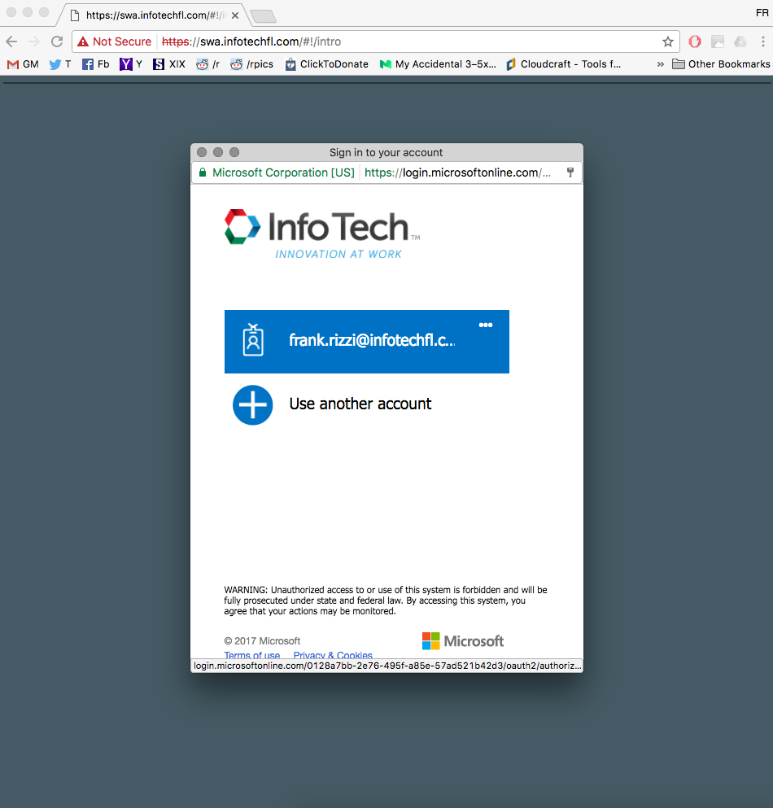
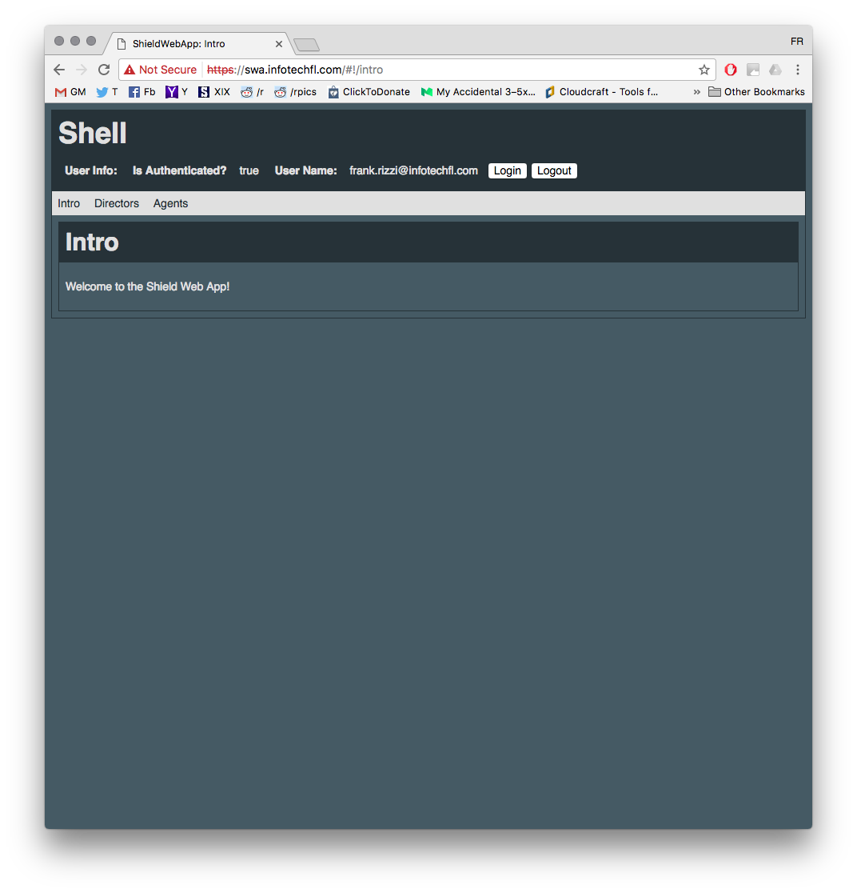
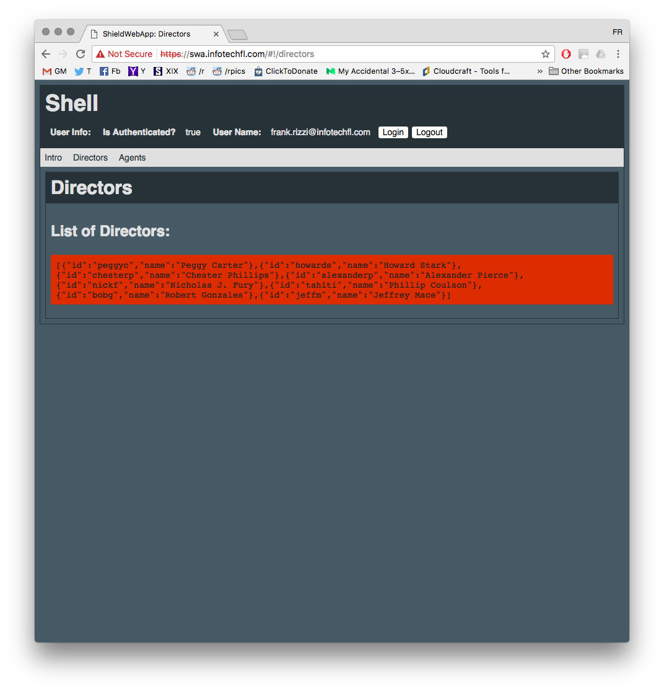

[Previously in the BAS Series](../BAS3-pwa/README.md), we protected the web app client.

# Building a Shield: Protecting the Web Service

Our web app may require the user to login through the corporate identity provider, but our web service is still open for all to access indiscriminately.
That will not do for our highly sensitive information (and any operation we may provide through the web service).<br />
On the plus side, the web app is already set to feed the user's credentials to the web service, with each request it makes, so all we have to do is make this information required and validate it.

## The Use Case

The core features of the web service are not going to change, so we expect it will still serve responses as follows:

* GET <root_URI>/directors: produce the list of known directors of S.H.I.E.L.D.
* GET <root_URI>/agents: produce the list of agents of S.H.I.E.L.D.

However, each of these API endpoints should require the user's credentials to be provided in the **Authentication** HTTP Header. When credentials are missing, or invalid, the service should reject the request, returning an error status code.

### What We Start With

As a reminder, based on what we put together as our [Unprotected Web Service](../BAS1-uws/README.md), here's what we start with:

* **2 Python Scripts:** namely [directors.py](./directors.py) and [agents.py](./agents.py), producing the list of data we must secure
* **A CloudFormation Template:** [sws_cfn.yaml](./sws_cfn.yaml) which defines the following resources:
   * **SWSRole:** an IAM Role with the permissions (defined by **SWSPolicy**) required by the AWS Services to use our resources, and by our resources to use the necessary AWS services.
   * **SWSAPI:** An AWS API Gateway REST API resource, with paths for *GET* and *OPTIONS* (for CORS Support) requests both on *\agents* and *\directors*.
   * **Lambda Functions and Permissions:** namely *DirectorsLambda*, *DirectorsLambdaPermission*, *AgentsLambda*, and *AgentsLambdaPermission*, configuring the Python scripts above as Lambda Functions and ensuring they can be triggered by the *SWSAPI* REST API methods.
* **A make script:** namely [make.sh](./make.sh) to streamline the operations related to deploying the web service to AWS: preparing lambda packages, packaging the CloudFormation template, deploying it, and obtaining the corresponding JS SDK.

## How We'll Auth

AWS API Gateway provides a feature that serves our purpose, known as **Custom Authorizers** ([here's the official AWS docs](http://docs.aws.amazon.com/apigateway/latest/developerguide/use-custom-authorizer.html)). These are Lambda functions you can specify as authorizers for REST APIs and methods in AWS API Gateway; they are invoked when a configured HTTP endpoint is triggered, and are intended to determine whether the incoming request should be rejected as *unauthorized* or served (and, in this case, what resources the request should have access to).

### Custom Auth Interface

Custom Authorizers are provided with an **authorizationToken**, which API Gateway can fill with any data from the incoming HTTP request. In our case, for instance, we'll have API Gateway grab the value of the **Authorization** HTTP header, and pass it as authorizationToken.

In return, Custom Authorizers are expected to do one of the following:

* **Raise an exception:** if the request should not be served due to issues with the data received (eg: missing or misformatted credentials, etc..);
   * API Gateway will produce a response with status **401 - Unauthorized**
* **Produce an IAM Policy:** describing the API Gateway resources the request should be granted and denied access to; API Gateway will then attempt to use that policy in continuing the processing fo the request;<br />
   * API gateway will produce a response with status **403 - Forbidden** if the policy *Denies* access to the necessary resource

Our Custom Authorizer will validate the authorizationToken and produce a policy that will either *Allow* or *Deny* access to all of the API Gateway resources in our REST API.

### Token Validation

The primary job of our Custom Authorizer will be that of verifying the validity of the user credentials received in the form of a [JWT Token](https://jwt.io/), as issued by the MS Azure AD identity provider (eg: when the user logged in through the web app). A good reference on the topic is available on [MS Azure AD Documentation](https://docs.microsoft.com/en-us/azure/active-directory/develop/active-directory-v2-tokens#validating-tokens). In short, the custom authorizer will:

* Extract the *kid* (*Key Identifier*) property from the token's headers
* Retrieve the X.509 Certificate published by MS Azure AD, and associated with that *kid* value
* Extract the public key from the certificate
* Use the public key to verify the signature on the token
* Verify other token claims

The same documentation gives us information on how to obtain the certificates used by MS Azure AD:

* Access the MS OpenID Connect metadata document at [https://login.microsoftonline.com/common/v2.0/.well-known/openid-configuration](https://login.microsoftonline.com/common/v2.0/.well-known/openid-configuration)
* Find the value of the *jwks_uri* property (eg: [https://login.microsoftonline.com/common/discovery/v2.0/keys](https://login.microsoftonline.com/common/discovery/v2.0/keys)), and access that document
* Among the *keys* listed, find one with the *kid* (and *x5t*) properties matching the *kid* value from the token to be validated
* Use the value of the first item in the *x5c* list for that key as an X.509 certificate

In order to simplify the operations of our custom authorizer, and minimize the latency of our system, we'll perform the retrieval of these certificates separately. Furthermore, we'll implement this retrieval as an automated scheduled process, since Microsoft warns us that:

> The v2.0 endpoint periodically rotates the possible set of keys, so your app should be written to handle those key changes automatically. A reasonable frequency to check for updates to the public keys used by the v2.0 endpoint is every 24 hours.

## Certsgrabber

Certsgrabber (the script to perform the retrieval of the MS Azure certificates) requires the use of a 3rd-party library (the [requests](http://docs.python-requests.org/en/master/) library), and this library is not built-in to the [AWS Lambda Execution Environment](http://docs.aws.amazon.com/lambda/latest/dg/current-supported-versions.html). Thus, things get a bit more complicated than they were for the *agents.py* and *directors.py* scripts.

Namely, we'll develop certsgrabber in a [virtual environment](http://python-guide-pt-br.readthedocs.io/en/latest/dev/virtualenvs/) in the *\certsgrabber* subdirectory, so that we will be able to determine its dependencies when we need to build its Lambda Deployment Package.

The one-time setup for certsgrabber:

* Install virtualenv and [virtualenvwrapper](https://virtualenvwrapper.readthedocs.io/en/latest/) globally:
   * `$> pip install virtualenv`
   * `$> pip install virtualenvwrapper`
* Create, activate, and configure a *certsgrabber* project to use the *\certsgrabber* subdirectory:
   * `$> mkproject certsgrabber`
   * `$> setvirtualenvproject $VIRTUAL_ENV <path/to/>/certsgrabber`
   * `$> cdproject`
* Install certsgrabber's dependencies:
   * `$> pip install -r requirements.txt`

### Certsgrabber.py

[certsgrabber.py](./certsgrabber/certsgrabber.py) is pretty straight forward:

* It requires a **DESTINATION_BUCKET** environmental variable, the name of the S3 bucket to save the certificates to
* It retrieves the list of keys from [https://login.microsoftonline.com/common/discovery/v2.0/keys](https://login.microsoftonline.com/common/discovery/v2.0/keys), and saves them to the bucket
   * Each key's *kid* property is used as key for the object in the bucket

### Certsgrabber CloudFormation

We modify the [sws_cfn.yaml](./sws_cfn.yaml) CloudFormation template:

* **Add SWSCertBucket:** The S3 Bucket where certsgrabber will store the certificates.
* **Add CertsGrabberLambda:** A Lambda Function to trigger the certsgrabber script on a schedule. This resource includes:
   * *CodeUri:* set to *./certsgrabber.zip* (the Lambda Deployment Package which we'll produce below)
   * *Environment\Variables\DESTINATION_BUCKET:* The environmental variable our function expects
   * *Events\CertsGrabberSchedule:* The schedule (every 6 hours) to trigger certsgrabber
* **Modify SWSPolicy:** so that various operations needed on the *SWSCertsBucket* are allowed

### Certsgrabber and make

As mentioned above, certsgrabber relies upon a 3rd-party library (*requests*) which is not available by default in the [AWS Lambda Execution Environment](http://docs.aws.amazon.com/lambda/latest/dg/current-supported-versions.html). If you remember back when we created the [Unprotected Web Service](../BAS1-uws/README.md), there was a section (*"Lambdas and Cloud Formations"*) describing the different scenarios when building a Lambda Deployment Package.

Accordingly, we modify our [make.sh](./make.sh) script:

* **Add VENVS_HOME:** a new configurable parameter, which should point to the location on your drive of the virtual environments home directory (eg: *VENVS_HOME="$WORKON_HOME"*, as the *$WORKON_HOME* environmental variable should point to the appropriate location)
* **Remove certsgrabber.zip:** in case this is not our first build
* **Create a new certsgrabber.zip archive:** with the following contents:
   * **/certsgrabber/certsgrabber.py**
   * **any dependency** found in *$VENVS_HOME/certsgrabber/lib/python2.7/site-packages*

## CustAuth

With the signing certificates available in a known S3 bucket, we can work on the Custom Authorizer to validate the tokens: custauth. This too will have to rely on 3rd-party libraries, and therefore should be developed in a virtual environment.

The one-time setup for cauth:

* Install virtualenv and [virtualenvwrapper](https://virtualenvwrapper.readthedocs.io/en/latest/) globally:
   * `$> pip install virtualenv`
   * `$> pip install virtualenvwrapper`
* Create, activate, and configure a *custauth* project to use the *\custauth* subdirectory:
   * `$> mkproject custauth`
   * `$> setvirtualenvproject $VIRTUAL_ENV <path/to/>/custauth`
   * `$> cdproject`
* Install custauth's dependencies:
   * `$> pip install -r requirements.txt`

### CustAuth.py

You can read throughout the code in [/custauth/custauth.py](./custauth/custauth.py), but here are some highlights:

* 3rd-party modules:<br />
   * **pyjwt:** [pyjwt.readthedocs.io](https://pyjwt.readthedocs.io/en/latest/)
   * **cryptography:** [cryptography.io](https://cryptography.io/en/latest/)
* Environmental Variables:<br />
   * **AUTH_APP_ID:** the MS Azure AD application/client ID
   * **AUTH_TENANT_ID:** the MS Azure AD tenant ID
   * **CERTS_BUCKET:** the name of the S3 Bucket with the MS Azure certificates
* **401 - Unauthorize:** the error code we return if we don't receive an *authorizationToken* to validate
* **403 - Forbidden:** the error code we return if the validation fails (custauth will return a policy set to *Deny* access, and API gateway will produce this error)
* **Token Validation:** in *TokenValidator* you can see the steps involved:<br />
   * Verify the incoming authorization token is in the form *"Bearer \<id_token>"*
   * The *id_token* is parsed (without verification), to extract the *kid* header
   * We retrieve a certificate matching the *kid* header from S3 (and fail validation if we can't find it)
   * We wrap the certificate in the standard *PEM* delimiters (and format it according to the 64 characters per line rule)
   * We extract the public key from the X.509 certificate
   * We use that key to attempt to verify the *id_token*, as well as other basic claims

### CustAuth CloudFormation

We modify the [sws_cfn.yaml](./sws_cfn.yaml) CloudFormation template:

* **New Input Parameters:** that will be used as environmental variables for the CustAuth Lambda function:<br />
   * **AUTHCLIENTID:** The Client Id according to MS Azure AD
   * **AUTHTENANT:** The Tenant Id according to MS Azure AD
* **New CustAuthLambda:** set to trigger the *custauth.lambda_handler* within the *custauth.zip* package, with 3 environmental variables: *AUTH_APP_ID*, *AUTH_TENANT_ID*, and *CERTS_BUCKET*
* **Modify the SWSAPI:**<br />
   * **DependsOn:** add *CustAuthLambda* among the resources the API is dependent on
   * **Add a securityDefinitions:** with a *SWSAPICustAuthorizer* property specifying the custom authorizer details
   * **Modify the GET method for the agents and directors paths:** by adding:
      * The *Authorization* Header among the *parameters*
      * The *security* property, holding the *SWSAPICustAuthorizer: []* item

### CustAuth and make

As mentioned, the custauth.py relies on 3rd-party modules among which *pyjwt* and *cryptography*. As for the certsgrabber function, this implies we need to take care when building the Lambda Deployment Package. However, in this case, one of the 3rd-party modules (*cryptography*) has *binary dependencies*, which means it requires to be built targeting the run-time OS.

As documented in the [AWS Lambda Execution Environment](http://docs.aws.amazon.com/lambda/latest/dg/current-supported-versions.html), AWS Lambda uses images based on AMIs with Amazon Linux AMI as OS, listed [here](https://aws.amazon.com/amazon-linux-ami/).

I will not include at this point the step-by-step guide on how to obtain a copy of *cryptography* built for this OS (leaves me something to do at a later time), but suffice it to say I did so, and captured that version in [/libs-for-aws](./libs-for-aws).

Of course, we now have to modify the [make.sh](./make.sh) script to build the deployment package using the version of those libraries from */libs-for-aws* instead of those that may be installed on your machine or virtual environment at the time of the build.

This is similar to what we did for certsgrabber before, but:

* **We skip some libraries when adding them from the virtual environment dependencies:**

```shell
zip -r9 $PACKZIP * \
   -x _cffi_backend.so \
   -x cffi \
   -x cffi-1.10.0.dist-info \
   -x cryptography/\* \
   -x cryptography-1.8.1.dist-info/\*
```

* **We grab libraries from \libs-for-aws and include them in the package:**

```shell
zip -gr9 $PACKZIP \
   _cffi_backend.so \
   .libs_cffi_backend \
   cffi \
   cffi-1.10.0.dist-info \
   cryptography \
   cryptography-1.8.1-py2.7.egg-info/
```

* **We also add two Input Parameters:** *AUTH_APP_ID* and *AUTH_TENANT_ID*, which are then used when deploying the CloudFormation change set (via *--parameter-overrides* argument)

## Deploying to AWS

<div class="note warning">
   <h5>BEFORE running the next steps, you should:</h5>
   <p>Ensure make.sh is executable, Configure make.sh.</p>
</div>

* **Ensure make.sh is executable:**<br />
   * `$> chmod u+x make.sh`
* **Configure make.sh:**<br />
   Open the shell script and modify the configuration at the top as appropriate:
   * **PROFILE:** the name of the AWS profile (configured on your machine via AWS CLI)
   * **LBUCKET:** the name of the S3 Bucket created above
   * **SWSID:** (optional) this will be used to distinguish different instances of the web service
   * **STACKNAME:** (optional) this can be used to have separate AWS Cloud Formation Stacks
   * **VENVS_HOME:** (optional) the home directory for your virtual environments
   * **AUTH_APP_ID:** Your application Client Id according to MS Azure AD
   * **AUTH_TENANT_ID:** Your Tenant id according to MS Azure AD

**Finally:**

```shell
$>./make.sh

Make for SWSAPI:
========================================
AWS Profile              : your_aws_profile
Lambdas Bucket Name      : sws.lambdas
SWSID                    : swsdev
Stack Name               : SWSStack
Virtual Environments Home: your/path/to/.venvs
Auth Application Id      : your_client_id
Auth Tenant Id           : your_tenant_id

========================================
Preparing Lambda Packages:
========================================
certsgrabber:
   Removed certsgrabber.zip
   cd into '/Users/frankr/FRGH/AWSomesauce/articles/BAS4-pws/certsgrabber'
   zip warning: /Users/frankr/FRGH/AWSomesauce/articles/BAS4-pws/certsgrabber.zip not found or empty
  adding: certsgrabber.py (deflated 67%)
   Added certsgrabber.py to '/Users/frankr/FRGH/AWSomesauce/articles/BAS4-pws/certsgrabber.zip'.
   cd into '/Users/frankr/.venvs/certsgrabber/lib/python2.7/site-packages'
[...] adding files to certsgrabber.zip [...]
   Added dependencies to '/Users/frankr/FRGH/AWSomesauce/articles/BAS4-pws/certsgrabber.zip'.
   cd into '/Users/frankr/FRGH/AWSomesauce/articles/BAS4-pws'
custauth:
   Removed custauth.zip
   cd into '/Users/frankr/FRGH/AWSomesauce/articles/BAS4-pws/custauth'
   zip warning: /Users/frankr/FRGH/AWSomesauce/articles/BAS4-pws/custauth.zip not found or empty
  adding: custauth.py (deflated 72%)
   Added custauth.py to '/Users/frankr/FRGH/AWSomesauce/articles/BAS4-pws/custauth.zip'.
   cd into '/Users/frankr/.venvs/custauth/lib/python2.7/site-packages'
[...] adding files to custauth.zip [...]
   Added dependencies to '/Users/frankr/FRGH/AWSomesauce/articles/BAS4-pws/custauth.zip'.
   cd into '/Users/frankr/FRGH/AWSomesauce/articles/BAS4-pws/libs-for-aws'
[...] updating/adding files to custauth.zip [...]
   Added dependency (for AWS) to '/Users/frankr/FRGH/AWSomesauce/articles/BAS4-pws/custauth.zip'.
   cd into '/Users/frankr/FRGH/AWSomesauce/articles/BAS4-pws'
directors:
   Removed
  adding: directors.py (deflated 55%)
   OK
agents:
   Removed
  adding: agents.py (deflated 65%)
   OK

========================================
Packaging SAM CloudFormation Templates:
========================================
sws_cfn:
Uploading to ba80eb279f8e80b3b59e8c6576d5e0af  4329345 / 4329345.0  (100.00%)
Successfully packaged artifacts and wrote output template to file ./sws_cfn_packaged.yaml.
Execute the following command to deploy the packaged template
aws cloudformation deploy --template-file /Users/frankr/FRGH/AWSomesauce/articles/BAS4-pws/sws_cfn_packaged.yaml --stack-name <YOUR STACK NAME>
   OK

========================================
Deploying CloudFormation ChangeSet:
========================================
sws_cfn_packaged:
Waiting for changeset to be created..
Waiting for stack create/update to complete
Successfully created/updated stack - SWSStack
   OK

========================================
Retrieving Stack Outputs:
========================================
   OK
   SWSRestApiId: j1icuqmgj0

========================================
Requesting Deployment:
========================================
{
    "description": "Stage Deployment by make.sh", 
    "id": "lgurj0", 
    "createdDate": 1491999183
}
   OK

========================================
Requesting JS SDK:
========================================
{
    "contentType": "application/octet-stream", 
    "contentDisposition": "attachment; filename=\"null-0.0.1-javascript.zip\""
}
   OK

========================================
All Done.
```

The Web Service is now secured.

## Update the Web App

The previous step, of course, constitutes a new *release* of the web service. Although our main API method signature has not changed, internally we've tweaked their configuration by adding the Custom Authorizer. More importantly, at this stage, we made the *Authorization* HTTP header more prominent, as we expect it to carry the user credentials from the client.

As a result, the JS SDK that AWS produces based on the REST API definition has changed (in particular, it explicitly looks for the *Authorization* header when building outgoing requests). Thus, we should update and deploy our web app.

The write up about [Protecting the Web App](../BAS3-pwa/README.md) gives you all the details necessary, but the short version is:

* grab the *aws_js_sdk.zip* file that was saved in the last step of the web service deployment script
* use its contents to update your web app's *\src\js\apiGateway-js-sdk* directory
* re-build the web app locally via:<br />
   (**Don't skip this**, *because the make script used to deploy uses as source the directory used as destination by this step*)
   * `$> gulp serve`
* re-deploy the web app to AWS via
   * `$> ./make.sh`

<div class="note warning">
   <h5>CloudFront Edge Caching:</h5>
   <p>Our sample web app does not currently implement a versioned naming scheme for its files. If you already deployed the web app at least once, then the update you're deploying now may not be delivered to the web browsers until the objects in the CloudFront Distribution are expired or invalidated. See <a href="http://docs.aws.amazon.com/AmazonCloudFront/latest/DeveloperGuide/Invalidation.html#Invalidation_Expiration">the AWS Documentation</a> for more details, but a quick workaround is to use the AWS Web console, navigate to the CloudFront service page, select the Distribution your web app is deployed to, and in the <em>Invalidations</em> tab create a new one for the <em>/*</em> path to invalidate all objects.</p>
</div>

## Progress

Pointing a web browser to the address the web app has been (re) deployed to should provide you access as expected.



Log in with your AD credentials.



And access the pages displaying the data from the web service.



You can also check the CloudWatch logs through the AWS Web console to verify the operation of the Lambda functions involved (CustAuth, Directors, and Agents).

# That's it!

Thanks for reading - I hope this solution fits your use case. Comments and suggestions for improvements are welcome, of course.

# BAS Series
* [BAS - Intro](../BAS-intro/README.md)
* [BAS1 - Unprotected Web Service](../BAS1-uws/README.md)
* [BAS2 - Unprotected Web App](../BAS2-uwa/README.md)
* [BAS3 - Protecting the Web App](../BAS3-pwa/README.md)
* [BAS4 - Protecting the Web Service](../BAS4-pws/README.md)
